# Backoffice do Animalec: Adição de Patrocinadores e Especialistas

Este relatório documenta a tarefa de adicionar funcionalidades para o gerenciamento de patrocinadores e especialistas no painel administrativo (**backoffice**) do **Animalec**. O processo de desenvolvimento envolveu a criação de wireframes, mockups e um protótipo funcional para cada interface.

## Visão Geral da Tarefa

O objetivo desta tarefa foi adicionar ecrãs de gerenciamento para duas novas entidades, **Patrocinadores** e **Especialistas**, ao backoffice do Animalec. Estes ecrãs permitem que os utilizadores visualizem, adicionem, editem e excluam registros relacionados a patrocinadores e especialistas, ampliando as capacidades administrativas da plataforma Animalec.

## Processo de Desenvolvimento

Para cada ecrã, seguimos um processo de design e desenvolvimento estruturado:

1. **Criação de Wireframes**: 
   - Os wireframes foram desenhados para cada ecrã, focando no layout e nas funcionalidades, sem aplicar estilos. Isso forneceu uma estrutura básica para a disposição dos botões, tabelas e componentes de navegação para o gerenciamento de patrocinadores e especialistas.
   
   ### Wireframes
   - **Backoffice Mobile**  
     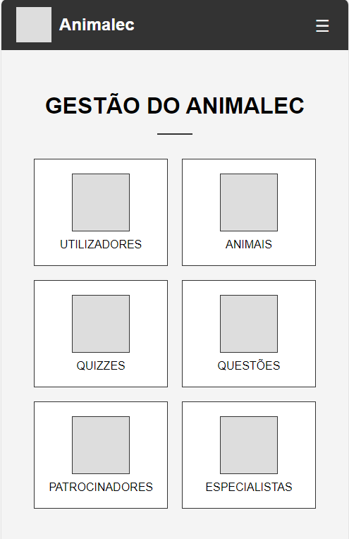
   - **Backoffice PC**  
     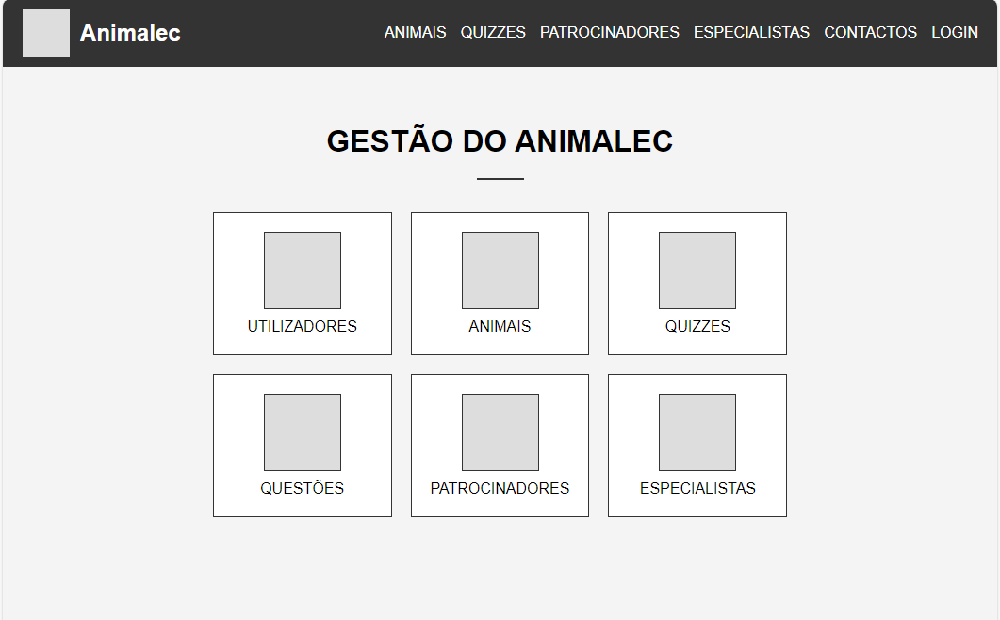
   - **Homepage Mobile**  
     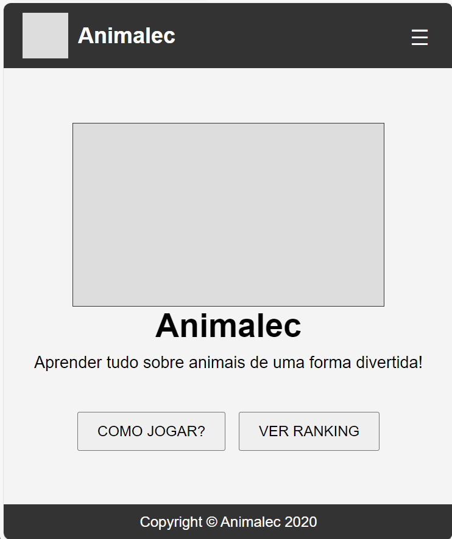
   - **Homepage PC**  
     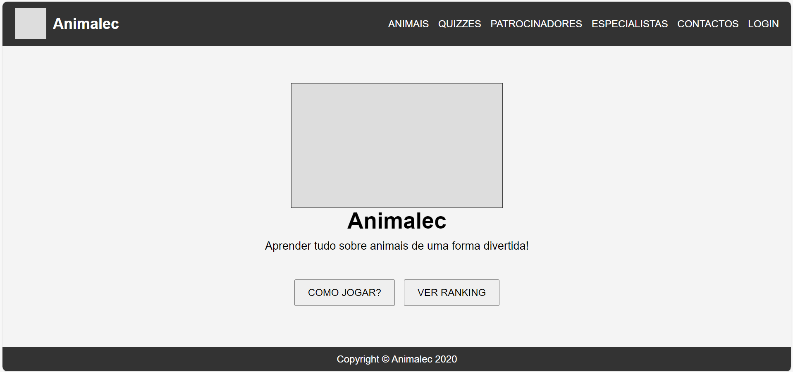
   - **Management Mobile**  
     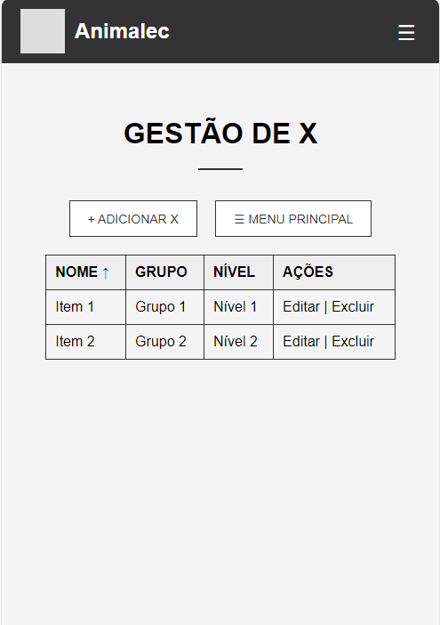
   - **Management PC**  
     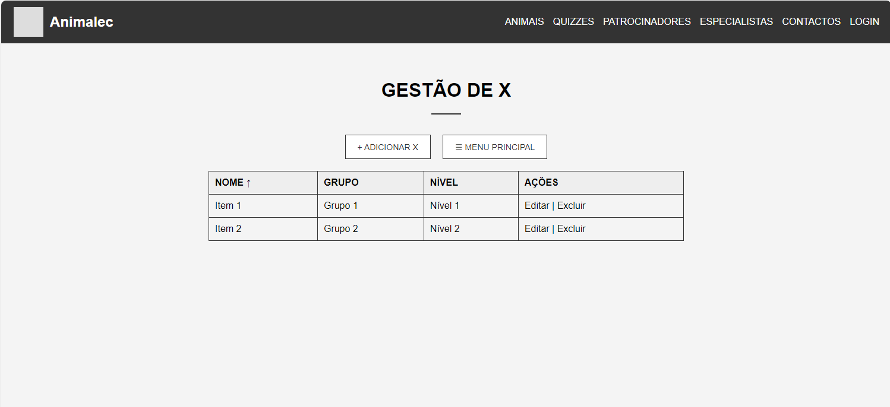

2. **Criação de Mockups**: 
   - Foram criados mockups para adicionar detalhes visuais aos wireframes. Esses mockups incluíram esquemas de cores, escolhas de fontes e a disposição dos elementos de interface, oferecendo uma visão mais próxima do design final.

   ### Mockups
   - **Backoffice Mobile**  
     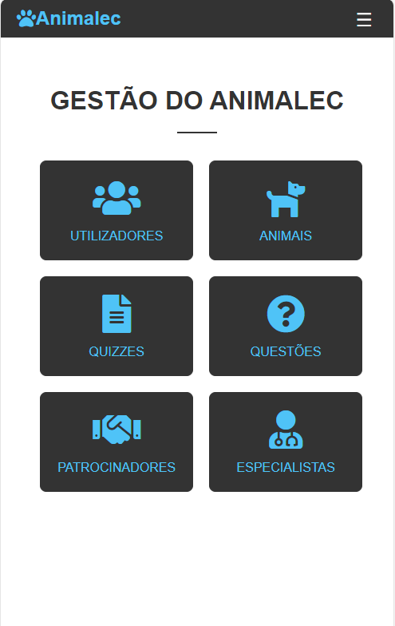
   - **Backoffice PC**  
     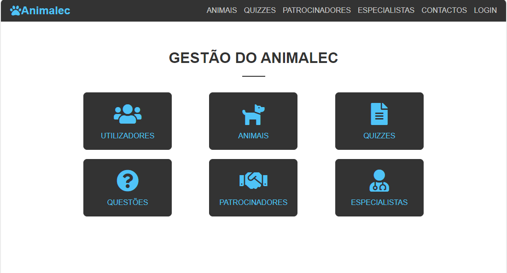
   - **Especialistas Mobile**  
     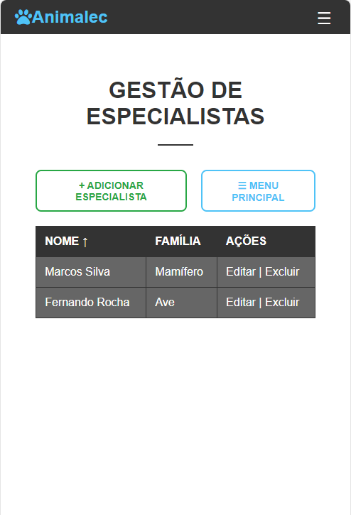
   - **Especialistas PC**  
     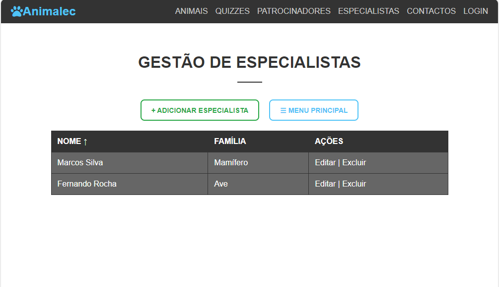
   - **Patrocinadores Mobile**  
     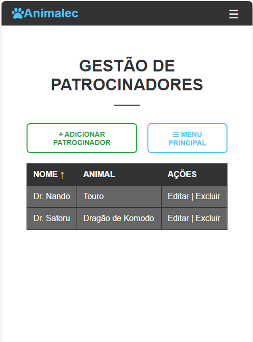
   - **Patrocinadores PC**  
     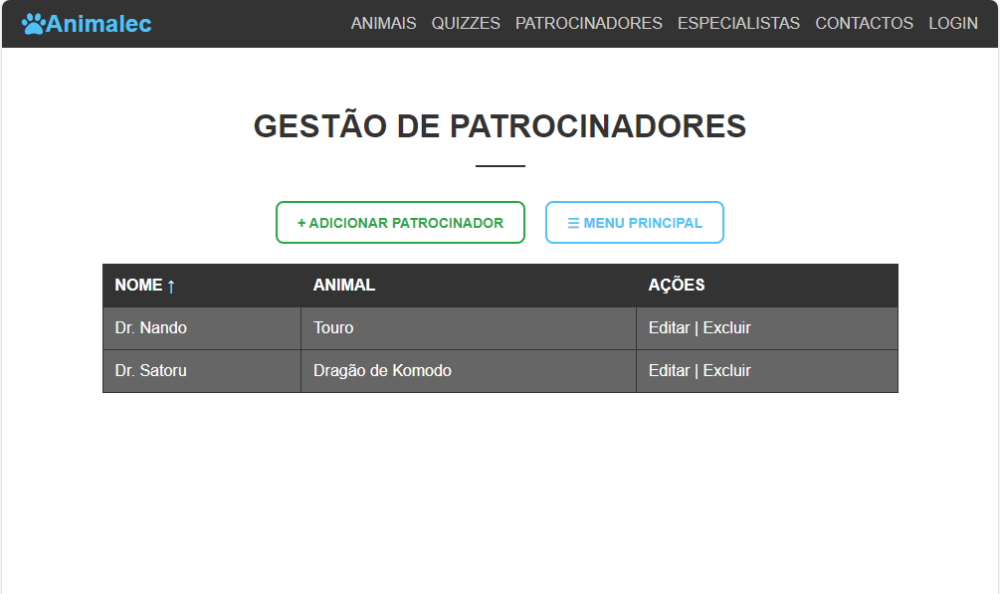
   - **Patrocinadores (Adicionar) PC**  
     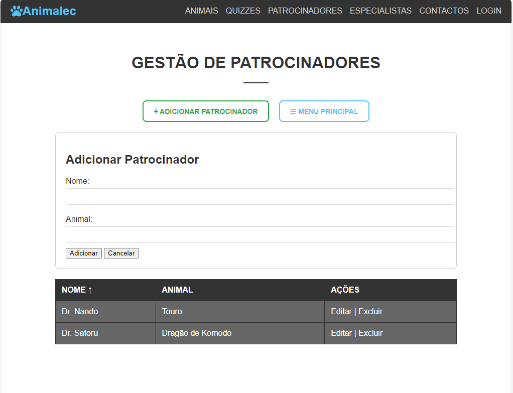

3. **Desenvolvimento do Protótipo**:
   - Com base nos wireframes e mockups, foi construído um protótipo funcional utilizando HTML e CSS. Este protótipo inclui:
     - **Painel de Controle (Backoffice)**: O painel principal do backoffice, permitindo a navegação para os ecrãs de gerenciamento de patrocinadores e especialistas.
     - **Ecrã de Gerenciamento de Patrocinadores**: Um ecrã dedicado para visualizar, adicionar, editar e excluir registros de patrocinadores.
     - **Ecrã de Gerenciamento de Especialistas**: Um ecrã similar para o gerenciamento de registros de especialistas.

O protótipo é composto por três arquivos HTML e CSS para cada ecrã. Esses arquivos incluem JavaScript para lidar com interações, como alternar a exibição de formulários para adicionar novos registros e realizar ações básicas de manipulação de dados.

## Arquivos

O protótipo inclui os seguintes arquivos:

- `index.html` e `style.css`: Para o **Painel de Controle do Backoffice**, fornecendo navegação para os ecrãs de gerenciamento de patrocinadores e especialistas.
- `sponsors.html` e `style.css`: Para o **Ecrã de Gerenciamento de Patrocinadores**, permitindo operações CRUD (criação, leitura, atualização e exclusão) nos registros de patrocinadores.
- `experts.html` e `style.css`: Para o **Ecrã de Gerenciamento de Especialistas**, permitindo operações CRUD nos registros de especialistas.

## Funcionalidade

O protótipo contém as seguintes funcionalidades:

- É possível navegar para os ecrãs de patrocinadores e especialistas.
- É possível visualizar uma tabela de itens exemplo.
- É possível adicionar e excluir itens das tabelas.
